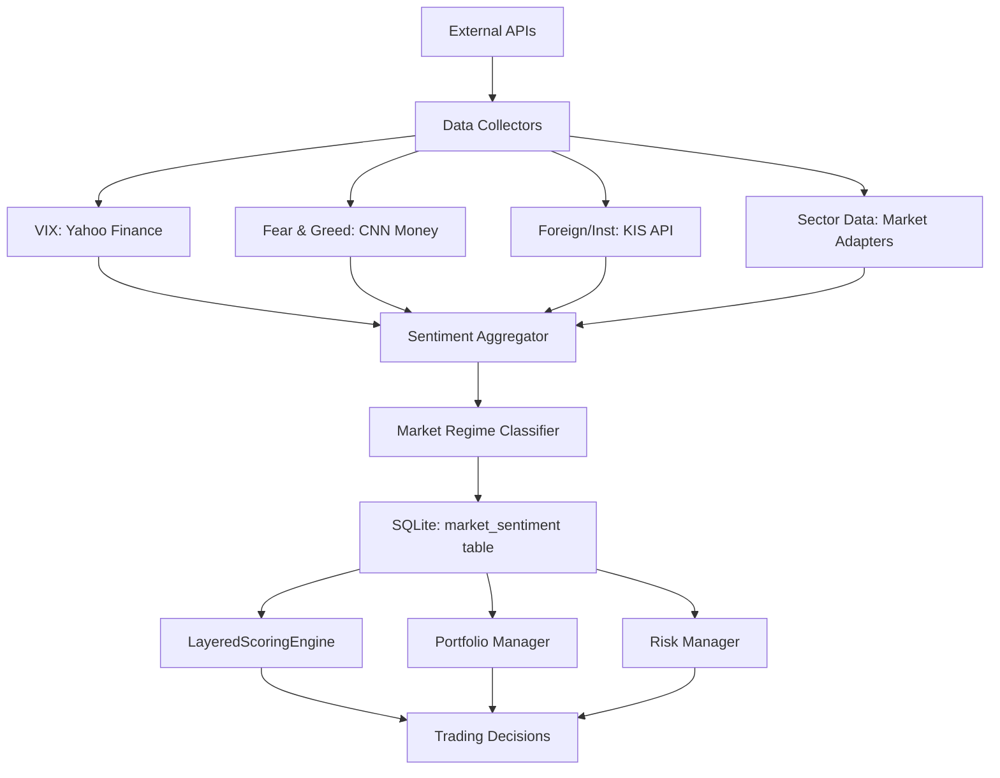

# Design Specification: stock_sentiment.py

**Module**: Market Sentiment Analysis & Monitoring
**Version**: 1.0
**Created**: 2025-10-14
**Author**: Spock Design Team
**Phase**: Phase 5 Task 5 - Market Sentiment Analysis

---

## 1. Executive Summary

### 1.1 Purpose
The `stock_sentiment.py` module provides comprehensive market sentiment analysis by aggregating multiple data sources (VIX volatility index, Fear & Greed Index, foreign/institutional trading, sector rotation) to help the Spock trading system adjust risk exposure and trading decisions based on overall market conditions.

### 1.2 Key Features
- **VIX Index Integration**: Real-time volatility monitoring with position sizing adjustment
- **Fear & Greed Index**: Market sentiment gauge for contrarian signals
- **Foreign/Institution Flow**: Net buying/selling tracking for Korean stocks
- **Sector Rotation**: GICS 11 sector relative strength analysis
- **Global Market Correlation**: US market overnight impact assessment
- **Risk Adjustment**: Dynamic position sizing based on market conditions

### 1.3 Success Criteria
- ✅ Daily sentiment data collection (<30 seconds)
- ✅ Integration with LayeredScoringEngine (Layer 1 - MarketRegimeModule)
- ✅ Position sizing adjustment based on VIX levels
- ✅ Sector rotation signals with ≥70% accuracy
- ✅ Error resilience with fallback data sources

---

## 2. Architecture & Design

### 2.1 Module Structure

```
stock_sentiment.py (800-1000 lines)
├── Data Collection Layer
│   ├── VIXDataCollector
│   ├── FearGreedCollector
│   ├── ForeignInstitutionCollector
│   └── SectorRotationAnalyzer
├── Analysis Layer
│   ├── SentimentAggregator
│   ├── VolatilityAnalyzer
│   └── MarketRegimeClassifier
├── Integration Layer
│   ├── Database Manager
│   └── Signal Generator
└── Utility Layer
    ├── API Retry Logic
    └── Data Validation
```

### 2.2 Data Flow Diagram



### 2.3 Component Dependencies

**External Dependencies**:
- `yfinance` - VIX data collection (^VIX symbol)
- `requests` - HTTP requests for Fear & Greed Index
- `beautifulsoup4` - HTML parsing for web scraping (if needed)
- `pandas` - Data manipulation and analysis
- `numpy` - Numerical calculations

**Internal Dependencies**:
- `modules.kis_data_collector` - Foreign/institution data from KIS API
- `modules.market_adapters.base_adapter` - Sector data collection
- `modules.db_manager_sqlite` - Database operations
- `modules.stock_utils` - Utility functions and retry logic

---

## 3. Data Structures

### 3.1 Core Data Classes

```python
from dataclasses import dataclass
from datetime import datetime
from typing import Dict, Optional
from enum import Enum

class MarketRegime(Enum):
    """Market regime classification"""
    BULL = "bull"               # Strong uptrend
    BULL_CORRECTION = "bull_correction"  # Minor pullback in uptrend
    SIDEWAYS = "sideways"       # Range-bound
    BEAR_RALLY = "bear_rally"   # Dead cat bounce
    BEAR = "bear"               # Strong downtrend

class VolatilityLevel(Enum):
    """VIX-based volatility classification"""
    LOW = "low"           # VIX <20
    MODERATE = "moderate" # VIX 20-30
    HIGH = "high"         # VIX 30-40
    EXTREME = "extreme"   # VIX >40

@dataclass
class VIXData:
    """VIX volatility index data"""
    date: str
    vix_value: float
    volatility_level: VolatilityLevel
    position_sizing_multiplier: float  # 1.0, 0.75, 0.5, 0.25
    change_percent: float
    timestamp: datetime

    def to_dict(self) -> Dict:
        return {
            'date': self.date,
            'vix_value': self.vix_value,
            'volatility_level': self.volatility_level.value,
            'position_sizing_multiplier': self.position_sizing_multiplier,
            'change_percent': self.change_percent,
            'timestamp': self.timestamp.isoformat()
        }

@dataclass
class FearGreedData:
    """Fear & Greed Index data"""
    date: str
    index_value: int  # 0-100
    sentiment: str    # "Extreme Fear", "Fear", "Neutral", "Greed", "Extreme Greed"
    contrarian_signal: bool  # True if extreme fear (<25) or extreme greed (>75)
    timestamp: datetime

    def to_dict(self) -> Dict:
        return {
            'date': self.date,
            'index_value': self.index_value,
            'sentiment': self.sentiment,
            'contrarian_signal': self.contrarian_signal,
            'timestamp': self.timestamp.isoformat()
        }

@dataclass
class ForeignInstitutionFlow:
    """Foreign/Institution net buying data"""
    date: str
    ticker: Optional[str]  # None for market-wide aggregation
    foreign_net_buy: float  # KRW
    institution_net_buy: float  # KRW
    consecutive_buy_days: int
    consecutive_sell_days: int
    signal: str  # "strong_buy", "buy", "neutral", "sell", "strong_sell"
    timestamp: datetime

    def to_dict(self) -> Dict:
        return {
            'date': self.date,
            'ticker': self.ticker,
            'foreign_net_buy': self.foreign_net_buy,
            'institution_net_buy': self.institution_net_buy,
            'consecutive_buy_days': self.consecutive_buy_days,
            'consecutive_sell_days': self.consecutive_sell_days,
            'signal': self.signal,
            'timestamp': self.timestamp.isoformat()
        }

@dataclass
class SectorRotationSignal:
    """Sector rotation analysis"""
    date: str
    sector: str  # GICS sector name
    relative_strength: float  # vs market average
    momentum_score: float  # 0-100
    trend: str  # "strengthening", "neutral", "weakening"
    is_hot_sector: bool  # Top 3 strongest sectors
    ranking: int  # 1-11 (GICS 11 sectors)
    timestamp: datetime

    def to_dict(self) -> Dict:
        return {
            'date': self.date,
            'sector': self.sector,
            'relative_strength': self.relative_strength,
            'momentum_score': self.momentum_score,
            'trend': self.trend,
            'is_hot_sector': self.is_hot_sector,
            'ranking': self.ranking,
            'timestamp': self.timestamp.isoformat()
        }

@dataclass
class MarketSentimentSummary:
    """Aggregated market sentiment summary"""
    date: str
    market_regime: MarketRegime
    vix_data: VIXData
    fear_greed_data: FearGreedData
    foreign_flow: ForeignInstitutionFlow
    sector_rotation: Dict[str, SectorRotationSignal]  # sector name -> signal
    overall_score: float  # -100 to +100 (bearish to bullish)
    recommended_position_sizing: float  # 0.0-1.0 multiplier
    trading_recommendation: str  # "aggressive", "moderate", "conservative", "defensive"
    timestamp: datetime

    def to_dict(self) -> Dict:
        return {
            'date': self.date,
            'market_regime': self.market_regime.value,
            'vix_data': self.vix_data.to_dict(),
            'fear_greed_data': self.fear_greed_data.to_dict(),
            'foreign_flow': self.foreign_flow.to_dict(),
            'sector_rotation': {k: v.to_dict() for k, v in self.sector_rotation.items()},
            'overall_score': self.overall_score,
            'recommended_position_sizing': self.recommended_position_sizing,
            'trading_recommendation': self.trading_recommendation,
            'timestamp': self.timestamp.isoformat()
        }
```

---

## 4. API Specifications

### 4.1 Main Class: MarketSentimentAnalyzer

```python
class MarketSentimentAnalyzer:
    """
    Main class for market sentiment analysis and monitoring

    Responsibilities:
    - Collect data from multiple sources (VIX, Fear & Greed, KIS API)
    - Analyze market regime and volatility
    - Generate trading signals based on sentiment
    - Update database with latest sentiment data
    """

    def __init__(
        self,
        db_path: str = 'data/spock_local.db',
        region: str = 'KR',
        enable_vix: bool = True,
        enable_fear_greed: bool = True,
        enable_foreign_flow: bool = True,
        enable_sector_rotation: bool = True
    ):
        """
        Initialize Market Sentiment Analyzer

        Args:
            db_path: SQLite database path
            region: Market region code (KR, US, HK, CN, JP, VN)
            enable_vix: Enable VIX data collection
            enable_fear_greed: Enable Fear & Greed Index
            enable_foreign_flow: Enable foreign/institution flow
            enable_sector_rotation: Enable sector rotation analysis
        """
        pass

    # ===== Data Collection Methods =====

    def collect_vix_data(self) -> VIXData:
        """
        Collect latest VIX volatility index data

        Source: Yahoo Finance (^VIX symbol)
        Update Frequency: Daily at 08:30 KST

        Returns:
            VIXData object with current VIX value and classification

        Raises:
            APIError: If VIX data collection fails
        """
        pass

    def collect_fear_greed_index(self) -> FearGreedData:
        """
        Collect Fear & Greed Index from CNN Money

        Source: https://money.cnn.com/data/fear-and-greed/
        Update Frequency: Daily at 08:30 KST

        Returns:
            FearGreedData object with sentiment classification

        Raises:
            APIError: If Fear & Greed data unavailable
        """
        pass

    def collect_foreign_institution_flow(
        self,
        ticker: Optional[str] = None,
        lookback_days: int = 5
    ) -> ForeignInstitutionFlow:
        """
        Collect foreign/institution net buying data

        Source: KIS API (FHKST01010900 - 주식 외국인 기관 순매수)
        Update Frequency: Daily after market close

        Args:
            ticker: Specific ticker (None for market-wide)
            lookback_days: Number of days to analyze for trends

        Returns:
            ForeignInstitutionFlow object with net buying data

        Raises:
            APIError: If KIS API call fails
        """
        pass

    def analyze_sector_rotation(self) -> Dict[str, SectorRotationSignal]:
        """
        Analyze sector rotation patterns

        Method:
        1. Calculate 20-day relative strength for each GICS sector
        2. Rank sectors by momentum score
        3. Identify hot sectors (top 3)

        Returns:
            Dictionary mapping sector name to SectorRotationSignal

        Raises:
            DatabaseError: If sector data unavailable
        """
        pass

    # ===== Analysis Methods =====

    def classify_market_regime(
        self,
        vix_data: VIXData,
        fear_greed: FearGreedData,
        foreign_flow: ForeignInstitutionFlow
    ) -> MarketRegime:
        """
        Classify current market regime

        Classification Logic:
        - BULL: VIX <20, Greed >60, Foreign buying >0
        - BULL_CORRECTION: VIX 20-30, Fear 40-60, Mixed flow
        - SIDEWAYS: VIX <25, Neutral 40-60, Low volume
        - BEAR_RALLY: VIX >30, Extreme Fear <25, Short covering
        - BEAR: VIX >40, Extreme Fear, Foreign selling

        Args:
            vix_data: Current VIX data
            fear_greed: Current Fear & Greed data
            foreign_flow: Recent foreign/institution flow

        Returns:
            MarketRegime enum value
        """
        pass

    def calculate_overall_sentiment_score(
        self,
        vix_data: VIXData,
        fear_greed: FearGreedData,
        foreign_flow: ForeignInstitutionFlow,
        sector_rotation: Dict[str, SectorRotationSignal]
    ) -> float:
        """
        Calculate overall market sentiment score (-100 to +100)

        Scoring Algorithm:
        - VIX contribution: -50 to +50 (lower VIX = more bullish)
        - Fear & Greed: -25 to +25 (extreme fear/greed = contrarian)
        - Foreign flow: -15 to +15 (net buying = bullish)
        - Sector breadth: -10 to +10 (more hot sectors = bullish)

        Args:
            vix_data: Current VIX data
            fear_greed: Fear & Greed Index data
            foreign_flow: Foreign/institution flow data
            sector_rotation: Sector rotation signals

        Returns:
            Sentiment score from -100 (extremely bearish) to +100 (extremely bullish)
        """
        pass

    def recommend_position_sizing(
        self,
        vix_data: VIXData,
        market_regime: MarketRegime,
        overall_score: float
    ) -> float:
        """
        Recommend position sizing multiplier based on market conditions

        Position Sizing Logic:
        - VIX <20 + Bull regime: 1.0x (full position)
        - VIX 20-30 + Bull correction: 0.75x
        - VIX 30-40 + Sideways: 0.5x
        - VIX >40 + Bear: 0.25x (defensive)

        Args:
            vix_data: Current VIX data
            market_regime: Classified market regime
            overall_score: Overall sentiment score

        Returns:
            Position sizing multiplier (0.25, 0.5, 0.75, or 1.0)
        """
        pass

    # ===== Integration Methods =====

    def get_market_sentiment_summary(
        self,
        date: Optional[str] = None
    ) -> MarketSentimentSummary:
        """
        Get comprehensive market sentiment summary

        This is the main method used by other modules for integration.

        Args:
            date: Specific date (YYYY-MM-DD), None for today

        Returns:
            MarketSentimentSummary with all sentiment data

        Raises:
            DatabaseError: If sentiment data not found
        """
        pass

    def update_daily_sentiment(self) -> bool:
        """
        Update daily market sentiment data (run at 08:30 KST)

        Workflow:
        1. Collect VIX data
        2. Collect Fear & Greed Index
        3. Collect foreign/institution flow
        4. Analyze sector rotation
        5. Classify market regime
        6. Calculate sentiment score
        7. Save to database
        8. Log summary

        Returns:
            True if update successful, False otherwise
        """
        pass

    def get_foreign_flow_for_ticker(
        self,
        ticker: str,
        region: str = 'KR',
        lookback_days: int = 5
    ) -> ForeignInstitutionFlow:
        """
        Get foreign/institution flow for specific ticker

        Used by LayeredScoringEngine for stock-specific sentiment.

        Args:
            ticker: Stock ticker
            region: Market region
            lookback_days: Number of days to analyze

        Returns:
            ForeignInstitutionFlow for the ticker
        """
        pass

    def get_sector_sentiment(self, sector: str) -> SectorRotationSignal:
        """
        Get sentiment for specific GICS sector

        Args:
            sector: GICS sector name (e.g., "Information Technology")

        Returns:
            SectorRotationSignal for the sector

        Raises:
            ValueError: If sector name invalid
        """
        pass

    # ===== Database Methods =====

    def save_sentiment_to_db(self, summary: MarketSentimentSummary) -> bool:
        """
        Save market sentiment summary to database

        Table: market_sentiment
        Columns:
        - date (TEXT, PRIMARY KEY)
        - market_regime (TEXT)
        - vix_value (REAL)
        - volatility_level (TEXT)
        - fear_greed_index (INTEGER)
        - foreign_net_buy (REAL)
        - institution_net_buy (REAL)
        - overall_score (REAL)
        - position_sizing_multiplier (REAL)
        - trading_recommendation (TEXT)
        - hot_sectors (TEXT, JSON)
        - created_at (TEXT)

        Args:
            summary: MarketSentimentSummary to save

        Returns:
            True if save successful
        """
        pass

    def get_sentiment_history(
        self,
        start_date: str,
        end_date: str
    ) -> List[MarketSentimentSummary]:
        """
        Get historical sentiment data

        Args:
            start_date: Start date (YYYY-MM-DD)
            end_date: End date (YYYY-MM-DD)

        Returns:
            List of MarketSentimentSummary objects
        """
        pass
```

---

## 5. Database Schema

### 5.1 market_sentiment Table

```sql
CREATE TABLE IF NOT EXISTS market_sentiment (
    date TEXT PRIMARY KEY,
    market_regime TEXT NOT NULL,  -- bull, bull_correction, sideways, bear_rally, bear

    -- VIX Data
    vix_value REAL,
    volatility_level TEXT,  -- low, moderate, high, extreme
    vix_change_percent REAL,

    -- Fear & Greed Index
    fear_greed_index INTEGER,  -- 0-100
    fear_greed_sentiment TEXT,  -- Extreme Fear, Fear, Neutral, Greed, Extreme Greed
    contrarian_signal INTEGER,  -- 0 or 1 (boolean)

    -- Foreign/Institution Flow (market-wide)
    foreign_net_buy REAL,  -- KRW
    institution_net_buy REAL,  -- KRW
    foreign_consecutive_buy_days INTEGER,
    foreign_consecutive_sell_days INTEGER,

    -- Sector Rotation
    hot_sectors TEXT,  -- JSON array of top 3 sectors
    sector_breadth_score REAL,  -- 0-100

    -- Overall Metrics
    overall_score REAL,  -- -100 to +100
    position_sizing_multiplier REAL,  -- 0.25, 0.5, 0.75, 1.0
    trading_recommendation TEXT,  -- aggressive, moderate, conservative, defensive

    -- Metadata
    created_at TEXT NOT NULL,
    updated_at TEXT
);

CREATE INDEX IF NOT EXISTS idx_sentiment_date ON market_sentiment(date);
CREATE INDEX IF NOT EXISTS idx_sentiment_regime ON market_sentiment(market_regime);
```

### 5.2 foreign_institution_flow Table

```sql
CREATE TABLE IF NOT EXISTS foreign_institution_flow (
    date TEXT NOT NULL,
    ticker TEXT,  -- NULL for market-wide aggregation
    region TEXT NOT NULL DEFAULT 'KR',

    -- Flow Data
    foreign_net_buy REAL,  -- KRW
    institution_net_buy REAL,  -- KRW
    foreign_volume INTEGER,  -- shares
    institution_volume INTEGER,  -- shares

    -- Trend Analysis
    consecutive_buy_days INTEGER DEFAULT 0,
    consecutive_sell_days INTEGER DEFAULT 0,
    signal TEXT,  -- strong_buy, buy, neutral, sell, strong_sell

    -- Metadata
    created_at TEXT NOT NULL,

    PRIMARY KEY (date, ticker, region)
);

CREATE INDEX IF NOT EXISTS idx_flow_ticker_date ON foreign_institution_flow(ticker, date DESC);
CREATE INDEX IF NOT EXISTS idx_flow_signal ON foreign_institution_flow(signal);
```

### 5.3 sector_rotation Table

```sql
CREATE TABLE IF NOT EXISTS sector_rotation (
    date TEXT NOT NULL,
    sector TEXT NOT NULL,  -- GICS sector name
    region TEXT NOT NULL DEFAULT 'KR',

    -- Rotation Metrics
    relative_strength REAL,  -- vs market average
    momentum_score REAL,  -- 0-100
    trend TEXT,  -- strengthening, neutral, weakening
    ranking INTEGER,  -- 1-11 (GICS 11 sectors)
    is_hot_sector INTEGER,  -- 0 or 1 (boolean)

    -- Performance Data
    daily_return REAL,
    weekly_return REAL,
    monthly_return REAL,

    -- Metadata
    created_at TEXT NOT NULL,

    PRIMARY KEY (date, sector, region)
);

CREATE INDEX IF NOT EXISTS idx_rotation_date_ranking ON sector_rotation(date, ranking);
CREATE INDEX IF NOT EXISTS idx_rotation_hot_sectors ON sector_rotation(is_hot_sector, date);
```

---

## 6. Integration Points

### 6.1 LayeredScoringEngine Integration

**Module**: `modules/integrated_scoring_system.py`
**Layer**: Layer 1 - MarketRegimeModule

```python
# In MarketRegimeModule
from modules.stock_sentiment import MarketSentimentAnalyzer

class MarketRegimeModule:
    def __init__(self):
        self.sentiment_analyzer = MarketSentimentAnalyzer()

    def score_market_regime(self, ticker: str, region: str) -> float:
        """
        Score market regime (0-5 points)

        Scoring:
        - Bull + Foreign buying: 5 points
        - Bull correction: 3 points
        - Sideways: 2 points
        - Bear rally: 1 point
        - Bear: 0 points
        """
        sentiment = self.sentiment_analyzer.get_market_sentiment_summary()
        foreign_flow = self.sentiment_analyzer.get_foreign_flow_for_ticker(ticker, region)

        base_score = {
            'bull': 4.0,
            'bull_correction': 3.0,
            'sideways': 2.0,
            'bear_rally': 1.0,
            'bear': 0.0
        }[sentiment.market_regime.value]

        # Add bonus for foreign buying
        if foreign_flow.signal in ['strong_buy', 'buy']:
            base_score += 1.0

        return min(base_score, 5.0)
```

### 6.2 Portfolio Manager Integration

**Module**: `modules/portfolio_manager.py`

```python
# In check_position_limits()
from modules.stock_sentiment import MarketSentimentAnalyzer

sentiment_analyzer = MarketSentimentAnalyzer()
sentiment = sentiment_analyzer.get_market_sentiment_summary()

# Adjust position sizing based on VIX
base_limit = 0.15  # 15% max per stock
adjusted_limit = base_limit * sentiment.recommended_position_sizing

if amount_krw > total_value * adjusted_limit:
    return False, f"Position limit exceeded (VIX-adjusted: {adjusted_limit*100:.1f}%)"
```

### 6.3 Risk Manager Integration

**Module**: `modules/risk_manager.py`

```python
# Add new circuit breaker type
class CircuitBreakerType(Enum):
    # ... existing types ...
    EXTREME_VOLATILITY = "extreme_volatility"  # VIX >40

# In check_circuit_breakers()
from modules.stock_sentiment import MarketSentimentAnalyzer

sentiment_analyzer = MarketSentimentAnalyzer()
sentiment = sentiment_analyzer.get_market_sentiment_summary()

if sentiment.vix_data.volatility_level == VolatilityLevel.EXTREME:
    return CircuitBreakerSignal(
        breaker_type=CircuitBreakerType.EXTREME_VOLATILITY,
        trigger_value=sentiment.vix_data.vix_value,
        limit_value=40.0,
        trigger_reason=f"VIX at {sentiment.vix_data.vix_value:.1f} (extreme volatility)"
    )
```

---

## 7. Error Handling & Resilience

### 7.1 Error Scenarios

| Error Type | Scenario | Recovery Strategy |
|------------|----------|-------------------|
| **API Timeout** | VIX data unavailable | Retry 3 times, fallback to previous day's data |
| **HTTP Error** | Fear & Greed site down | Skip this indicator, use other sources |
| **KIS API Limit** | Rate limit exceeded | Exponential backoff, use cached data |
| **Data Parse Error** | Malformed HTML/JSON | Log error, return neutral sentiment |
| **Database Error** | SQLite lock | Retry with exponential backoff |
| **Missing Data** | No historical data | Use default neutral values |

### 7.2 Fallback Data Sources

**Primary → Fallback**:
- VIX: Yahoo Finance → CBOE website → Previous day's data
- Fear & Greed: CNN Money → Alternative.me crypto index → Neutral (50)
- Foreign/Institution: KIS API → Market summary data → Neutral (0)
- Sector Rotation: Live calculation → Cached data → Equal weight assumption

### 7.3 Data Validation

```python
def validate_vix_data(vix_value: float) -> bool:
    """Validate VIX data is within reasonable range"""
    if not (5.0 <= vix_value <= 100.0):
        logger.warning(f"VIX value {vix_value} outside normal range (5-100)")
        return False
    return True

def validate_fear_greed_index(index_value: int) -> bool:
    """Validate Fear & Greed Index is 0-100"""
    if not (0 <= index_value <= 100):
        logger.error(f"Fear & Greed index {index_value} invalid (must be 0-100)")
        return False
    return True

def validate_foreign_flow(net_buy: float) -> bool:
    """Validate foreign flow data is reasonable"""
    # Sanity check: daily net buy shouldn't exceed ₩1 trillion for single stock
    if abs(net_buy) > 1_000_000_000_000:
        logger.warning(f"Foreign net buy {net_buy:,.0f} seems unrealistic")
        return False
    return True
```

---

## 8. Performance Requirements

### 8.1 Response Time Targets

| Operation | Target Time | Notes |
|-----------|-------------|-------|
| Collect VIX data | <5 seconds | Yahoo Finance API call |
| Collect Fear & Greed | <10 seconds | Web scraping with timeout |
| Collect foreign flow | <15 seconds | KIS API (may have rate limiting) |
| Analyze sector rotation | <5 seconds | Database query + calculation |
| **Total daily update** | **<30 seconds** | All sentiment data collection |
| Get sentiment summary | <100ms | Database query only |

### 8.2 Data Freshness

- **VIX**: Updated daily at 08:30 KST (after US market close)
- **Fear & Greed**: Updated daily at 08:30 KST
- **Foreign/Institution**: Updated daily at 16:00 KST (after KR market close)
- **Sector Rotation**: Calculated daily at 16:00 KST

### 8.3 Resource Usage

- Memory: <50 MB for sentiment data
- Database: ~10 KB per day (365 days = 3.6 MB/year)
- Network: ~500 KB per daily update
- CPU: <10% during sentiment collection

---

## 9. Testing Strategy

### 9.1 Unit Tests

```python
# test_stock_sentiment.py

def test_vix_classification():
    """Test VIX volatility level classification"""
    assert classify_vix(15.0) == VolatilityLevel.LOW
    assert classify_vix(25.0) == VolatilityLevel.MODERATE
    assert classify_vix(35.0) == VolatilityLevel.HIGH
    assert classify_vix(45.0) == VolatilityLevel.EXTREME

def test_fear_greed_contrarian():
    """Test contrarian signal detection"""
    assert is_contrarian_signal(20) == True   # Extreme Fear
    assert is_contrarian_signal(50) == False  # Neutral
    assert is_contrarian_signal(80) == True   # Extreme Greed

def test_foreign_flow_signal():
    """Test foreign flow signal classification"""
    # Strong buy: >100M for 3+ days
    assert classify_flow(150_000_000, 3) == "strong_buy"
    # Neutral: mixed or small volume
    assert classify_flow(10_000_000, 1) == "neutral"

def test_market_regime_classification():
    """Test market regime classification logic"""
    # Bull market conditions
    vix = VIXData(vix_value=15.0, ...)
    fear_greed = FearGreedData(index_value=70, ...)
    flow = ForeignInstitutionFlow(foreign_net_buy=200_000_000, ...)

    regime = classify_market_regime(vix, fear_greed, flow)
    assert regime == MarketRegime.BULL

def test_position_sizing_recommendation():
    """Test position sizing multiplier calculation"""
    vix_low = VIXData(vix_value=15.0, volatility_level=VolatilityLevel.LOW, ...)
    assert recommend_position_sizing(vix_low, MarketRegime.BULL, 80.0) == 1.0

    vix_high = VIXData(vix_value=35.0, volatility_level=VolatilityLevel.HIGH, ...)
    assert recommend_position_sizing(vix_high, MarketRegime.BEAR, -50.0) == 0.5
```

### 9.2 Integration Tests

```python
def test_daily_sentiment_update():
    """Test full daily sentiment update workflow"""
    analyzer = MarketSentimentAnalyzer()
    success = analyzer.update_daily_sentiment()

    assert success == True

    # Verify data saved to database
    summary = analyzer.get_market_sentiment_summary()
    assert summary.vix_data.vix_value > 0
    assert 0 <= summary.fear_greed_data.index_value <= 100

def test_sentiment_integration_with_scoring():
    """Test integration with LayeredScoringEngine"""
    from modules.integrated_scoring_system import LayeredScoringEngine

    engine = LayeredScoringEngine()
    score = engine.score_stock('005930', 'KR')

    # Verify market regime score is included
    assert 'market_regime' in score.breakdown
```

### 9.3 Mocking External APIs

```python
# Use pytest fixtures for mocking
@pytest.fixture
def mock_vix_api(monkeypatch):
    """Mock Yahoo Finance VIX API"""
    def mock_download(*args, **kwargs):
        return pd.DataFrame({
            'Close': [25.5],
            'Date': [datetime.now()]
        })

    monkeypatch.setattr('yfinance.download', mock_download)

@pytest.fixture
def mock_fear_greed_api(monkeypatch):
    """Mock Fear & Greed Index scraping"""
    def mock_get(*args, **kwargs):
        class MockResponse:
            status_code = 200
            text = '<div class="market-fng-gauge__dial-number-value">45</div>'
        return MockResponse()

    monkeypatch.setattr('requests.get', mock_get)
```

---

## 10. Implementation Checklist

### Phase 1: Core Data Collection (Day 1)
- [ ] Implement VIXDataCollector with Yahoo Finance
- [ ] Implement FearGreedCollector with web scraping
- [ ] Implement ForeignInstitutionCollector with KIS API
- [ ] Add retry logic and error handling
- [ ] Unit tests for all collectors

### Phase 2: Analysis & Classification (Day 2)
- [ ] Implement MarketRegime classification logic
- [ ] Implement VolatilityLevel classification
- [ ] Implement SectorRotationAnalyzer
- [ ] Implement sentiment score calculation
- [ ] Unit tests for classification logic

### Phase 3: Database Integration (Day 2)
- [ ] Create database schema (market_sentiment, foreign_institution_flow, sector_rotation)
- [ ] Implement save_sentiment_to_db()
- [ ] Implement get_sentiment_summary()
- [ ] Implement get_sentiment_history()
- [ ] Database integration tests

### Phase 4: System Integration (Day 3)
- [ ] Integrate with LayeredScoringEngine
- [ ] Integrate with Portfolio Manager
- [ ] Integrate with Risk Manager
- [ ] Add daily update scheduler (08:30 KST, 16:00 KST)
- [ ] Integration tests

### Phase 5: Testing & Validation (Day 3)
- [ ] Complete unit test coverage (≥80%)
- [ ] Integration testing with mock APIs
- [ ] End-to-end testing with live APIs (dry-run)
- [ ] Performance benchmarking
- [ ] Error scenario testing

---

## 11. Future Enhancements

### v1.1 Enhancements
- [ ] Global market correlation (NASDAQ overnight impact)
- [ ] USD/KRW, JPY/KRW exchange rate impact
- [ ] Commodity price correlation (oil, gold, copper)
- [ ] Social sentiment analysis (Twitter, Reddit)

### v1.2 Enhancements
- [ ] Machine learning sentiment classification
- [ ] Sentiment prediction (next-day forecast)
- [ ] Sentiment-based trading strategy optimization
- [ ] Real-time sentiment streaming

---

## 12. Success Metrics

**Data Quality**:
- ✅ VIX data availability: ≥99%
- ✅ Fear & Greed data availability: ≥95%
- ✅ Foreign/Institution data accuracy: ≥98%

**Performance**:
- ✅ Daily update completion: <30 seconds
- ✅ Sentiment query response: <100ms
- ✅ System uptime: ≥99.5%

**Trading Impact**:
- ✅ Position sizing adjustment effectiveness: ≥70%
- ✅ Market regime classification accuracy: ≥75%
- ✅ Sector rotation signal win rate: ≥70%

---

**End of Design Specification**
