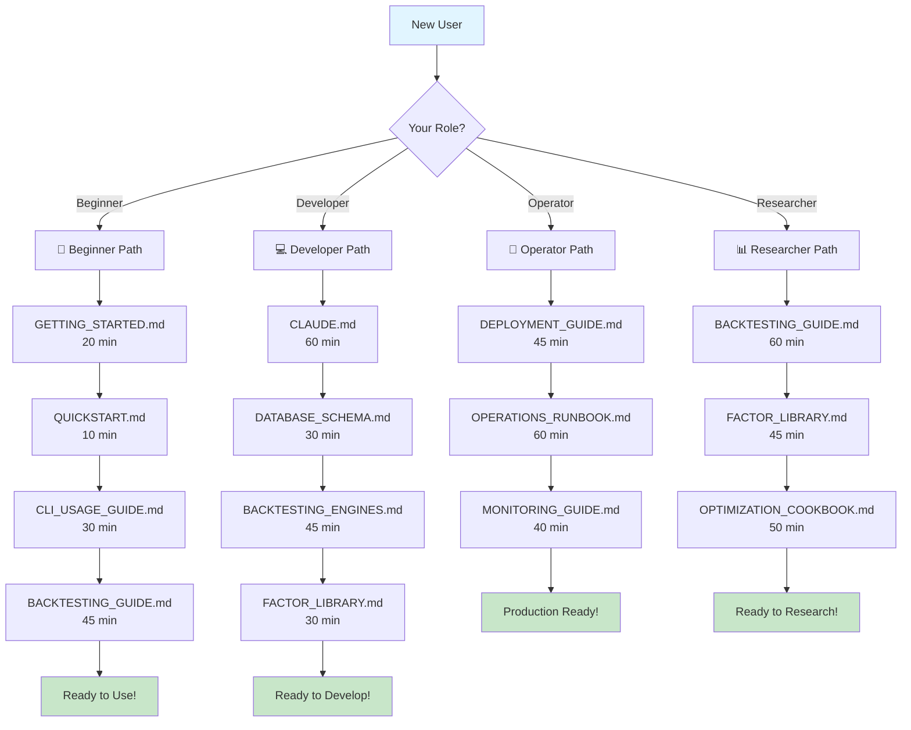

# Visual Assets Guide

**Recommended diagrams, screenshots, and visual materials for the Quant Investment Platform**

---

## 📋 Purpose

This document outlines the visual assets that should be created to improve documentation clarity and user understanding. Visual materials are currently **not included** but are highly recommended for better user experience.

---

## 🎯 Priority Overview

| Priority | Asset Type | Estimated Effort | Impact |
|----------|-----------|------------------|--------|
| **High** | System Architecture Diagram | 2-3 hours | High |
| **High** | Learning Path Flowchart | 1-2 hours | High |
| **Medium** | Backtesting Process Diagram | 1-2 hours | Medium |
| **Medium** | Dashboard Screenshots | 1 hour | Medium |
| **Low** | Factor Analysis Diagrams | 2-3 hours | Low |
| **Low** | Video Tutorials | 1-2 days | High (long-term) |

---

## 🏗️ 1. System Architecture Diagram (Priority: HIGH)

### Purpose
Help users understand the overall system structure and component relationships.

### Recommended Content

**Title**: "Quant Investment Platform Architecture"

**Components to Show**:
```
┌─────────────────────────────────────────────────────────────────┐
│                     User Interface Layer                         │
├─────────────────┬─────────────────┬──────────────────────────────┤
│  Streamlit      │  FastAPI        │  CLI                         │
│  Dashboard      │  REST API       │  Commands                    │
└────────┬────────┴────────┬────────┴────────┬────────────────────┘
         │                 │                 │
┌────────▼─────────────────▼─────────────────▼────────────────────┐
│                     Business Logic Layer                         │
├──────────────────┬──────────────────┬──────────────────────────┬─┤
│  Multi-Factor    │  Backtesting     │  Portfolio      │  Risk   │
│  Analysis        │  Engine          │  Optimization   │  Mgmt   │
│  ├─ Value        │  ├─ Custom       │  ├─ MVO         │  ├─VaR │
│  ├─ Momentum     │  ├─ vectorbt     │  ├─ Risk Parity │  ├─CVaR│
│  ├─ Quality      │  ├─ backtrader   │  ├─ Black-Lit.  │  └─... │
│  └─ ...          │  └─ zipline      │  └─ Kelly       │         │
└──────────┬───────┴──────────────────┴──────────────────┴────────┘
           │
┌──────────▼────────────────────────────────────────────────────────┐
│                     Data Access Layer                             │
├──────────────────┬────────────────────────────────────────────────┤
│  DataProvider    │  PostgresDataProvider                          │
│  Interface       │  ├─ Connection Pooling                         │
│                  │  ├─ Query Optimization                         │
│                  │  └─ Caching Layer                              │
└──────────┬───────┴────────────────────────────────────────────────┘
           │
┌──────────▼────────────────────────────────────────────────────────┐
│                     Database Layer                                │
├──────────────────┬────────────────────────────────────────────────┤
│  PostgreSQL      │  TimescaleDB Extension                         │
│  ├─ tickers      │  ├─ Hypertables (ohlcv_data)                  │
│  ├─ strategies   │  ├─ Continuous Aggregates                     │
│  └─ ...          │  └─ Compression Policies                      │
└───────────────────┴────────────────────────────────────────────────┘
           │
┌──────────▼────────────────────────────────────────────────────────┐
│                     External Data Sources                         │
├──────────────────┬──────────────────┬────────────────────────────┤
│  KIS API         │  Polygon.io      │  yfinance                  │
│  (Korea)         │  (Global)        │  (Backup)                  │
└──────────────────┴──────────────────┴────────────────────────────┘
```

### Tools Recommendation
- **Draw.io** (free, web-based)
- **Lucidchart** (professional)
- **Mermaid** (code-based, can be embedded in Markdown)

### File Location
`docs/images/architecture_diagram.png`

---

## 🗺️ 2. Learning Path Flowchart (Priority: HIGH)

### Purpose
Guide users through the learning journey based on their role.

### Recommended Content

**Title**: "Learning Path by User Type"



### Tools Recommendation
- **Mermaid** (embedded in Markdown)
- **Figma** (professional design)
- **Microsoft Visio** (enterprise)

### File Location
`docs/images/learning_path_flowchart.png`

---

## 🔄 3. Backtesting Process Diagram (Priority: MEDIUM)

### Purpose
Visualize the backtesting workflow from data loading to results.

### Recommended Content

**Title**: "Backtesting Workflow"

```
┌─────────────────────────────────────────────────────────────┐
│  Step 1: Data Loading                                       │
│  ├─ Load OHLCV data from PostgreSQL                         │
│  ├─ Date range: start_date to end_date                      │
│  └─ Tickers: Based on strategy universe                     │
└───────────┬─────────────────────────────────────────────────┘
            │
            ▼
┌─────────────────────────────────────────────────────────────┐
│  Step 2: Factor Calculation                                 │
│  ├─ Value Factors (P/E, P/B, etc.)                          │
│  ├─ Momentum Factors (12M return, RSI)                      │
│  ├─ Quality Factors (ROE, Debt Ratio)                       │
│  └─ Combine factors based on strategy                       │
└───────────┬─────────────────────────────────────────────────┘
            │
            ▼
┌─────────────────────────────────────────────────────────────┐
│  Step 3: Signal Generation                                  │
│  ├─ Rank stocks by combined factor score                    │
│  ├─ Select top N stocks (e.g., top 20)                      │
│  └─ Generate buy/sell signals                               │
└───────────┬─────────────────────────────────────────────────┘
            │
            ▼
┌─────────────────────────────────────────────────────────────┐
│  Step 4: Portfolio Construction                             │
│  ├─ Position sizing (equal weight, risk parity, etc.)       │
│  ├─ Apply constraints (max position, sector limits)         │
│  └─ Rebalancing frequency (monthly, quarterly)              │
└───────────┬─────────────────────────────────────────────────┘
            │
            ▼
┌─────────────────────────────────────────────────────────────┐
│  Step 5: Transaction Simulation                             │
│  ├─ Calculate transaction costs (commission + slippage)     │
│  ├─ Simulate order execution                                │
│  └─ Track portfolio holdings over time                      │
└───────────┬─────────────────────────────────────────────────┘
            │
            ▼
┌─────────────────────────────────────────────────────────────┐
│  Step 6: Performance Calculation                            │
│  ├─ Calculate returns (total, annualized, rolling)          │
│  ├─ Risk metrics (Sharpe, Sortino, Max DD)                  │
│  ├─ Trade statistics (win rate, profit factor)              │
│  └─ Risk measures (VaR, CVaR, Beta)                         │
└───────────┬─────────────────────────────────────────────────┘
            │
            ▼
┌─────────────────────────────────────────────────────────────┐
│  Step 7: Results Visualization                              │
│  ├─ Equity curve                                            │
│  ├─ Drawdown chart                                          │
│  ├─ Rolling Sharpe ratio                                    │
│  └─ Factor exposure over time                               │
└─────────────────────────────────────────────────────────────┘
```

### File Location
`docs/images/backtesting_process.png`

---

## 📱 4. Dashboard Screenshots (Priority: MEDIUM)

### Purpose
Show users what the platform looks like in action.

### Recommended Screenshots

1. **Strategy Builder**
   - File: `docs/images/dashboard_strategy_builder.png`
   - Shows: Strategy configuration UI

2. **Backtest Results**
   - File: `docs/images/dashboard_backtest_results.png`
   - Shows: Performance charts, metrics table

3. **Portfolio Analytics**
   - File: `docs/images/dashboard_portfolio.png`
   - Shows: Current holdings, allocation pie chart

4. **Factor Analysis**
   - File: `docs/images/dashboard_factor_analysis.png`
   - Shows: Factor performance, correlation matrix

5. **Risk Dashboard**
   - File: `docs/images/dashboard_risk.png`
   - Shows: VaR chart, stress test results

### Tools Recommendation
- **Browser Screenshot Tools** (built-in)
- **Snagit** (professional)
- **Lightshot** (free)

---

## 📊 5. Factor Analysis Diagrams (Priority: LOW)

### Purpose
Explain how factors work and are combined.

### Recommended Diagrams

**Factor Combination Process**:
```
Individual Factors
├─ Value Factor Score (0-100)
│  ├─ P/E Ratio (normalized)
│  ├─ P/B Ratio (normalized)
│  └─ Dividend Yield (normalized)
│
├─ Momentum Factor Score (0-100)
│  ├─ 12-Month Return
│  ├─ RSI Momentum
│  └─ 52-Week High Proximity
│
└─ Quality Factor Score (0-100)
   ├─ ROE
   ├─ Debt-to-Equity
   └─ Earnings Quality
        │
        ▼
┌─────────────────────────────────┐
│  Factor Combination Methods     │
├─────────────────────────────────┤
│  1. Equal Weight                │
│     Score = (V + M + Q) / 3     │
│                                 │
│  2. Optimized Weight            │
│     Score = 0.4V + 0.3M + 0.3Q  │
│                                 │
│  3. Machine Learning            │
│     Score = ML(V, M, Q)         │
└─────────────┬───────────────────┘
              │
              ▼
        Combined Score (0-100)
              │
              ▼
     Rank Stocks & Select Top N
```

### File Location
`docs/images/factor_combination.png`

---

## 🎥 6. Video Tutorials (Priority: LOW, Long-term)

### Purpose
Provide visual, step-by-step guides for common tasks.

### Recommended Videos

1. **5-Minute Quick Start** (Priority: High)
   - Duration: 5 minutes
   - Content: Installation → First backtest
   - Platform: YouTube

2. **Factor Strategy Development** (Priority: Medium)
   - Duration: 15 minutes
   - Content: Creating a momentum-value strategy
   - Platform: YouTube

3. **Dashboard Walkthrough** (Priority: Medium)
   - Duration: 10 minutes
   - Content: Tour of all dashboard features
   - Platform: YouTube

4. **Advanced Optimization** (Priority: Low)
   - Duration: 20 minutes
   - Content: Walk-forward optimization, portfolio constraints
   - Platform: YouTube

### Tools Recommendation
- **OBS Studio** (free, screen recording)
- **Camtasia** (professional, editing)
- **Loom** (quick, cloud-based)

---

## 📁 File Organization

### Recommended Directory Structure

```
docs/
├── images/
│   ├── architecture_diagram.png
│   ├── learning_path_flowchart.png
│   ├── backtesting_process.png
│   ├── factor_combination.png
│   ├── dashboard_strategy_builder.png
│   ├── dashboard_backtest_results.png
│   ├── dashboard_portfolio.png
│   ├── dashboard_factor_analysis.png
│   └── dashboard_risk.png
│
├── videos/
│   ├── 01_quick_start.mp4
│   ├── 02_strategy_development.mp4
│   ├── 03_dashboard_walkthrough.mp4
│   └── 04_advanced_optimization.mp4
│
└── diagrams/
    ├── architecture.mmd (Mermaid source)
    ├── learning_path.mmd
    └── backtesting_workflow.mmd
```

---

## 🛠️ Creation Workflow

### Step 1: Prioritize
1. System Architecture Diagram
2. Learning Path Flowchart
3. Dashboard Screenshots
4. Backtesting Process Diagram
5. Factor Analysis Diagrams
6. Video Tutorials (long-term)

### Step 2: Create Diagrams
```bash
# Install Mermaid CLI (optional)
npm install -g @mermaid-js/mermaid-cli

# Generate diagram from .mmd file
mmdc -i architecture.mmd -o architecture.png
```

### Step 3: Take Screenshots
1. Run Streamlit dashboard: `streamlit run dashboard/app.py`
2. Navigate to each page
3. Take high-quality screenshots (at least 1920x1080)
4. Crop and optimize images

### Step 4: Integrate into Documentation
```markdown
# Example: Adding diagram to README

## System Architecture


The platform consists of 5 main layers:
- User Interface Layer (Streamlit, FastAPI, CLI)
- Business Logic Layer (Backtesting, Factors, Optimization)
- ...
```

---

## 📏 Image Specifications

### Diagrams
- **Format**: PNG (for transparency) or SVG (for scalability)
- **Resolution**: Minimum 1920x1080 for raster images
- **Color Scheme**:
  - Primary: `#1976D2` (Blue)
  - Secondary: `#43A047` (Green)
  - Accent: `#F57C00` (Orange)
  - Background: `#FFFFFF` (White)
  - Text: `#212121` (Dark Gray)

### Screenshots
- **Format**: PNG
- **Resolution**: 1920x1080 (Full HD)
- **File Size**: <500KB (use compression)
- **Annotations**: Red boxes, arrows for important UI elements

### Videos
- **Format**: MP4 (H.264)
- **Resolution**: 1920x1080 (Full HD)
- **Frame Rate**: 30fps
- **Bitrate**: 5000kbps
- **Audio**: AAC, 128kbps

---

## 🎨 Design Guidelines

### Consistency
- Use consistent color schemes across all visuals
- Use same font family (e.g., Arial, Helvetica)
- Maintain consistent icon style

### Clarity
- Avoid cluttered diagrams
- Use whitespace effectively
- Label all components clearly
- Add legends when needed

### Accessibility
- Use high contrast colors
- Avoid red-green combinations (colorblind-friendly)
- Provide text alternatives for images
- Ensure text is readable at small sizes

---

## ✅ Checklist for Visual Assets

### Diagrams
- [ ] System Architecture Diagram
- [ ] Learning Path Flowchart
- [ ] Backtesting Process Diagram
- [ ] Factor Combination Diagram
- [ ] Database Schema Diagram

### Screenshots
- [ ] Strategy Builder
- [ ] Backtest Results
- [ ] Portfolio Analytics
- [ ] Factor Analysis
- [ ] Risk Dashboard

### Videos
- [ ] 5-Minute Quick Start
- [ ] Strategy Development
- [ ] Dashboard Walkthrough
- [ ] Advanced Optimization

### Documentation Integration
- [ ] Update README.md with diagrams
- [ ] Update GETTING_STARTED.md with screenshots
- [ ] Update BACKTESTING_GUIDE.md with process diagram
- [ ] Add video links to DOCUMENTATION_INDEX.md

---

## 📞 Need Help Creating Visuals?

### Resources
- **Mermaid Live Editor**: https://mermaid.live/
- **Draw.io**: https://app.diagrams.net/
- **Canva** (for infographics): https://www.canva.com/
- **Figma** (for UI mockups): https://www.figma.com/

### Community Contributions
If you create high-quality visual assets for this project, please submit them via Pull Request!

---

**Last Updated**: 2025-11-12
**Version**: 1.0.0
**Status**: Planning document (assets not yet created)

**Note**: This document serves as a guide for future visual asset creation. The actual creation of these assets is recommended but not currently implemented.
